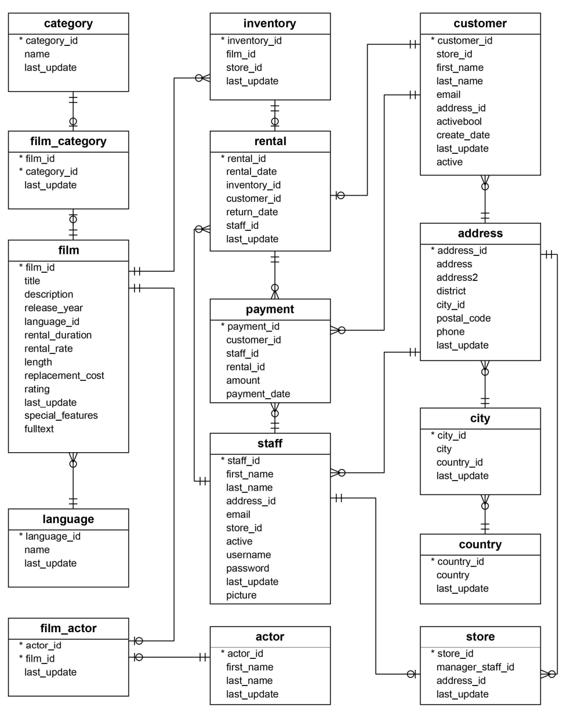

# 📀 DVD_Rental-PostgreSQL Project


## 📚 Introduction

This project is a hands-on deep dive into **PostgreSQL**, the robust open-source relational database system used worldwide for managing structured data.

At the core of this dataset are **15 thoughtfully designed tables** that simulate a fully operational DVD rental business: **'customer'**, **'actor'**, **'staff'**, **'payment'**, **'inventory'**, **'film'**, **'film_actor'**, **'film_category'**,**'category'**, **'address'**, '**city'**, **'country'**, **'rental'**, **'store'**, and **'language'**.
Each table captures a unique aspect of the business from inventory and customer behavior to payment history and staff management.

By walking through this project, you'll:

- 📌 Strengthen your understanding of relational database structures
- 🔍 Practice writing real-world SQL queries
- 🧠 Explore entity relationships, joins, and aggregation
- 🚀 Prepare a polished portfolio piece that reflects practical data skills

Whether you're just beginning your SQL journey or polishing your portfolio, this project brings the **theory of database design into real-world context**. Welcome to the rental desk let's query.

## 🎯 Objectives

- Apply practical SQL querying techniques to explore, analyze, and manipulate relational data.
- Use PostgreSQL as the core system for data management and business insight extraction.
- Employ Git for version control, project tracking, and collaborative development.
- Maintain clear documentation and a well-organized project structure for GitHub showcase.

## 🛠️ Tools & Technologies

| Tool                            | Purpose                                                |
| ------------------------------- | ------------------------------------------------------ |
| **PostgreSQL**                  | Core relational database system for running queries    |
| **VS Code**                     | Code editor used for writing SQL and documentation     |
| **SQLTools**                    | VS Code extension for connecting and executing queries |
| **pgAdmin 4**                   | GUI for exploring schemas and visualizing the ERD      |
| **Git**                         | Version control for managing project changes           |
| **GitHub**                      | Cloud-based hosting for version-controlled code        |
| **Markdown**                    | For writing documentation like README and reports      |
| **Power BI / Excel** (optional) | Data visualization and trend dashboards                |

## 🗄️ DVD Rental Database Tables

| Table Name      | Description                                                          |
| --------------- | -------------------------------------------------------------------- |
| `actor`         | Stores actor details like first name, last name, and timestamps.     |
| `film`          | Stores film metadata: title, description, release year, rating, etc. |
| `film_actor`    | Links films and actors (many-to-many relationship).                  |
| `category`      | Defines film genres or categories (e.g., Comedy, Action).            |
| `film_category` | Links films to categories (many-to-many relationship).               |
| `store`         | Stores location data and associated manager for each store.          |
| `inventory`     | Tracks copies of films available at each store.                      |
| `rental`        | Records rental transactions and return dates.                        |
| `payment`       | Tracks payments for rentals made by customers.                       |
| `staff`         | Stores employee info including login credentials and role.           |
| `customer`      | Contains customer details and activity status.                       |
| `address`       | Stores address info for customers and staff.                         |
| `city`          | Maps cities to addresses.                                            |
| `country`       | Maps countries to cities.                                            |
| `language`      | Stores language information for films.                               |

## 🧩 Data Modeling Overview

The data model of the DVD Rental database is designed to mirror the operations of a physical DVD rental business, incorporating both **transactional** and **reference** data across 15 interconnected tables.

This relational schema ensures high normalization (up to 3NF), promoting data integrity and reducing redundancy a structure that supports scalable querying, meaningful joins, and real-world business logic.

### 🔗 Key Modeling Highlights:

- 🧍 **Person Entities**:  
  `customer`, `staff`, and `address` represent individuals involved in transactions and store operations. The `address` table normalizes location data shared across staff and customers.

- 🎞️ **Film Metadata**:  
  Tables like `film`, `language`, `category`, and `actor` store descriptive attributes about each film.  
  Relationships such as `film_actor` and `film_category` handle many-to-many mappings via bridge tables.

- 🏪 **Inventory Management**:  
  `store`, `inventory`, and `film` are tightly linked. Each film copy exists in inventory and is tied to a specific store.

- 🔁 **Transactional Flow**:  
  `rental` captures the rental event with timestamps and links to `customer`, `inventory`, and `staff`.  
  `payment` records financial transactions tied to rentals.

- 🌍 **Geographic Dimension**:  
  `city` and `country` are normalized lookup tables referenced by `address`.

This modeling approach provides the backbone for realistic analytics from revenue trends and customer behavior to inventory efficiency and film popularity all driven by a clean, relational design.

## 📊 DVD Rental ER Diagram



## 📂 Project Structure

```
DVD-RENTAL_PROJECT/

├── .vscode/
│ └── settings.json # VS Code workspace preferences
│ │
├── DVD_Rental-PostgreSQL/
│ │
│ ├── Dashboards/
│ │ └── rental_analysis.xlsx # Excel dashboard with rental KPIs
│ │
│ ├── Diagram/
│ │ ├── dvdrental_ERD.png # Entity Relationship Diagram (ERD)
│ │ └── dvdRental_Thumbnail.png # Visual for README or GitHub cards
│ │
│ ├── PostgreSQL/
│ │ ├── dataExploratory.sql # Table overviews, basic SELECTs
│ │ ├── customer-behavior.sql # Retention, spending, patterns
│ │ ├── revenue-analysis.sql # Category and time-based revenue
│ │ └── advanced-queries.sql # CTEs, views, window functions
│ │
│ └── Reports/
│   └──Insight_summary.md # Key findings and observations
│
├── LICENSE # Open-source license
│
└── README.md # Project documentation and guide
```
## 📊 Query Categories / SQL Files (Exploration, Analysis, Advanced)

| File                    | Purpose & Focus                                             |
| ----------------------- | ----------------------------------------------------------- |
| `dataExploratory.sql`   | Initial schema exploration, table structure, simple SELECTs |
| `customer-behavior.sql` | Analyze customer patterns, activity rates, and retention    |
| `revenue-analysis.sql`  | Understand revenue by film, category, and time dimensions   |
| `advanced-queries.sql`  | CTEs, subqueries, and window functions for complex insights |

> 🔍 Check out [Insight Summary](./Reports/insight_summary.md) for detailed insights based on these queries.

## 📈 Dashboards

This Excel dashboard summarizes key insights from the DVD Rental database project.

It includes:

- KPI cards (Total Customers, Total Revenue, Most Popular Category, etc.)
- Top 10 customers by rental count (Bar chart)
- Clean layout for visual storytelling
  👉 **[Download Full Excel Dashboard](./Dashboards/rental_analysis.xlsx)**

> Use Excel to open and explore insights with pivot charts and tables.

## 📘 How to Run / Setup Instructions

### 1️⃣ Clone the Repository

```bash
https://github.com/PunleuTY/DVD_Rental-PostgreSQL
```

### 2️⃣ Import the Database

```markdown
Use pgAdmin or your preferred PostgreSQL client.

Load the dvdrental.tar backup file (you can download from PostgreSQL sample page).

Restore it into a new database named: dvdrental.
```

### 3️⃣ Connect to the Database

```markdown
Run your queries using:

pgAdmin

DBeaver

Or the integrated SQL Console in VS Code (with the PostgreSQL extension).
```

### 4️⃣ Explore the SQL Files

```markdown
SQL files are organized by category:

dataExploratory.sql – Basic data audit

customer-behavior.sql – Churn, frequency, segmentation

revenue-analysis.sql – Monthly and category-based revenue

advanced-queries.sql – CTEs, window functions, advanced slicing
```

### 5️⃣ View the Dashboard

```markdown
All exported results are available in the Dashboards/ folder.

🔗 Download the dashboard:
📊 Excel Dashboard (Above Link)

Open it in Excel:

Use PivotTables and Charts for dynamic filtering

KPIs include: Total Revenue, Active Customers, Rental Rates, Top Categories, and more
```

## 🧠 Final Thoughts / Credits

This project aims to bridge raw data with business decisions. Through SQL-driven analysis and an interactive Excel dashboard, we uncover customer behavior patterns, revenue insights, and operational strengths.

**Key Contributions:**

- 📊 Data Analysis: PunleuTY
- 🛠️ SQL Design & Querying: PunleuTY
- 🎨 Dashboard Design: PunleuTY

Special thanks to:

- [PostgreSQL DVDRental Dataset](https://neon.tech/postgresql/postgresql-getting-started/postgresql-sample-database) for real-world practice
- CADT Instructors & Peers for feedback and inspiration
